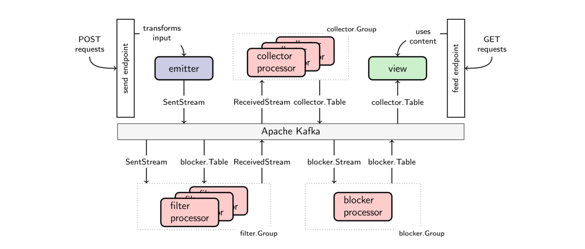

# A long example: Building a messaging service

In this example, we build a ficticious messaging service that employs several features available in Goka.
Our main goal is to explore all methods available in `Context` and to illustrate how components can be composed with joins and lookups.

The messaging service offers only two endpoints:

1. `localhost:8080/{user}/send`
2. `localhost:8080/{user}/feed`

The *user* in the URLs refers to the user performing the request.
The *send* endpoint takes JSON data containing the recipient and the content of a message and emits it to Kafka.
The *feed* endpoint shows the latest 5 messages received by the user.

We will develop the example in 4 steps, building the pipeline between both endpoints:

1. We start with a simple implementation that collects emitted messages in a table.
2. Next, we add the capability of blocking annoying users.
3. We then introduce a word translator to help (or amuse) users.
4. Finally, we block annoying users automatically with a simplistic spam detector.

## 1. Basic components and features

Goka provides three components to build systems: emitters, processors, and views.
The following figure depicts our initial design using these three components together with Kafka and the endpoints.


The architecture here follows the approach in [this blog post](https://tech.lovoo.com/2017/05/23/goka/).

### Send endpoint

The main type we will be dealing with is the [`Message`](message.go#L14) type:

```go
type Message struct {
	From    string
	To      string
	Content string
}
```

If Bob wants to send a message to Alice, he would send a request to the send endpoint with the recipient and the content of the message.
For example:

```sh
curl -X POST                                                   \
    -d '{"to": "Alice", "content": "Hey, how are you doing?"}' \
    http://localhost:8080/Bob/send
```

The send handler parses message type, completing the `From` field.
Afterwards, it emits the message into the `ReceivedStream` topic using the receiver user as key (`m.To`):

```go
func send(emitter *goka.Emitter) func(w http.ResponseWriter, r *http.Request) {
	return func(w http.ResponseWriter, r *http.Request) {
		m := messaging.Message{"From": mux.Vars(r)["user"]}
		b, _ := ioutil.ReadAll(r.Body)
		json.Unmarshal(b, &m)
		emitter.EmitSync(m.To, &m)
	}
}
```

The emitter is configured to only emit into the `ReceivedStream` topic and to use `MessageCodec` to encode the message `m`.
This is how the emitter is [created](service/service.go#L24):
```go
emitter, _ := goka.NewEmitter(
	brokers,
	messaging.ReceivedStream,
	new(messaging.MessageCodec),
)
router.HandleFunc("/{user}/send", send(emitter)).Methods("POST")
```

Note we are ignoring errors for the sake of readability.
The complete example in the repository handles them, though.

### Collecting messages with `Context.Value()` and `Context.SetValue()`

We define the *collector table* to contain the latest 5 messages received by each user.
The *collector processor* keeps the table up-to-date by consuming `ReceivedStream`.
The collector callback is defined as [follows](collector/collector.go#L29):

```go
// collect callback is called for every message from ReceivedStream.
// ctx allows access to collector table and msg is the input message.
func collect(ctx goka.Context, msg interface{}) {
	var ml []messaging.Message
	if v := ctx.Value(); v != nil {
		ml = v.([]messaging.Message)
	}

	m := msg.(*messaging.Message)
	ml = append(ml, *m)

	if len(ml) > maxMessages {
		ml = ml[len(ml)-maxMessages-1:]
	}
	ctx.SetValue(ml)
}

```

The `ctx` is scoped with the key of the input message -- remember we used the receiver as key in the emitter.
With `ctx.Value()` we fetch the table value for that key.
In this processor, the value is a slice of messages.
We then append the received message and cap the length of the slice with the constant `maxMessages`, which is 5.
Finally, we store the value back in the table with `ctx.SetValue()`.


To create the processor, we need to define the group input stream and table persistency:
```go
g := goka.DefineGroup(goka.Group("collector"),
	// the group table ("collector-table") persists message lists
	goka.Persist(new(MessageListCodec)),
	// input stream is ReceivedStream with MessageCodec and collect callback
	goka.Input(messaging.ReceivedStream, new(messaging.MessageCodec), collect),
)
p, _ := goka.NewProcessor(brokers, g)
```

### Feed endpoint

When Alice wants to see her 5 latest received messages, she requests that from the feed endpoint.
For example:
```
$ curl localhost:8080/Alice/feed
Latest messages for Alice
0        Bob: Hey, how are you doing?
1    Charlie: See you later.
```

The handler employs a view on `collector.Table` to retrieve the messages for Alice.
It gets the user from the URL and tries to get the value from the view.
If no value is available, the user has received no messages yet.
Otherwise, the handler loops over the messages in the slice and formats the output.

```go
func feed(view *goka.View) func(w http.ResponseWriter, r *http.Request) {
	return func(w http.ResponseWriter, r *http.Request) {
		user := mux.Vars(r)["user"]
		val, _ := view.Get(user)
		if val == nil {
			fmt.Fprintf(w, "%s not found!", user)
			return
		}
		messages := val.([]messaging.Message)
		fmt.Fprintf(w, "Latest messages for %s\n", user)
		for i, m := range messages {
			fmt.Fprintf(w, "%d %10s: %v\n", i, m.From, m.Content)
		}
	}
}
```

When creating the view, it is configured to watch the `collector.Table` and use `collector.MessageListCodec` to decode table values.

```go
view, _ := goka.NewView(
	brokers,
	collector.Table,
	new(collector.MessageListCodec),
)
router.HandleFunc("/{user}/feed", feed(view)).Methods("GET")
```

`MessageListCodec` simply encodes and decodes slices of `Message`s into and from JSON (see [implementation](message.go#L31) for details).

### Running the example

To make the system actually run, we still have to decide how to combine these components.
One option is to start emitter, processor, and view all in the same Go program, but that would make the system inflexible because we cannot scale the components independently.
We can also have each component running in its own Go program, but that may complicate deployment.
In this example, we put the endpoint handlers and, consequently, emitter and view in the same Go program.
In another Go program, we start the collector processor.
This solution allows us to start, stop, and scale them independently.

Before starting any Go program, run `make start` in `examples` to start Docker containers for ZooKeeper and Kafka.
Next, to start the service, change directory to `examples/3-messaging` and type:

```sh
go run cmd/service/main.go # start endpoint handlers, emitter and view
```

In another terminal, start the processor:

```sh
go run cmd/processor/main.go -collector # start collector processor
```

After you started both Go programs, you can use `curl` to see the messages sent to Alice:

```sh
curl localhost:8080/Alice/feed
```

or open [http://localhost:8080/Alice/feed](http://localhost:8080/Alice/feed) in the browser.

You can send messages using `curl`, for example,

```sh
curl -X POST                                                   \
    -d '{"to": "Alice", "content": "Hey, how are you doing?"}' \
    http://localhost:8080/Bob/send
```

To simplify the use of this example, we also have a load generator, which periodically
generates messages and sends them calling the send endpoint.
To start it, type the following in a third terminal:

```sh
go run cmd/loadgen/main.go
```

## 2. Blocking users

After running the example with the load generator for a while, one can recognize that Alice and other users receive quite a few messages from Bob.
Bob is actually a spammer and should be blocked!

### Blocker processor

For that we create a [blocker processor](blocker/blocker.go#L44), which keeps a table of users that have been blocked.
The blocker processor consumes from `blocker.Stream` and stores a `BlockValue` in the `blocker.Table`:

```go
func block(ctx goka.Context, msg interface{}) {
	var s *BlockValue
	if v := ctx.Value(); v == nil {
		s = new(BlockValue)
	} else {
		s = v.(*BlockValue)
	}

	if msg.(*BlockEvent).Unblock {
		s.Blocked = false
	} else {
		s.Blocked = true
	}
	ctx.SetValue(s)
}
```

To add or remove a user from the blocker table, we can use the command line tool cmd/block-user:

```sh
go run cmd/block-user/main.go -user Bob # use -unblock to unblock the user
```

### Filter messages from blocked users with `Context.Join()`

Of course, just adding Bob into `blocker.Table` does not yet guarantee users do not receive messages from him.
For that we need to add a filter between the send endpoint and the collector, which drops messages from blocked users before forwarding them to `ReceivedStream`.

Our block processor already keeps a table with a block flag for blocked keys, i.e., blocked users.
So, we change the emitter such that it emits into `SentStream`, with the key being now the *sender* instead of the recipient.
Next, we introduce a filter processor that consumes from `SentStream` and only if the key is not blocked, it emits the message into `ReceivedStream`.
The filter is stateless, i.e., it updates no group table.
See the following figure for the resulting architecture.



The [filter processor](filter/filter.go#L21) fetches the `BlockValue` for the sender by calling `ctx.Join(blocker.Table)`.
If such value exists and the flag is set to true, then the sender is blocked and the message has to be dropped.
Otherwise, the message is forwarded to `ReceivedStream` with the *recipient* as key.

```go
func filter(ctx goka.Context, msg interface{}) {
        // messaging.SentStream and blocker.Table are copartitioned;
	// ctx.Join() gets the value in blocker.Table for key given in ctx.Key()
	v := ctx.Join(blocker.Table)
	if v != nil && v.(*blocker.BlockValue).Blocked {
		return
	}
	ctx.Emit(messaging.ReceivedStream, m.To, m)
}
```

The group graph of the filter processor has to be created with an edge to `blocker.Table`:
```go
g := goka.DefineGroup(goka.Group("filter"),
	goka.Input(messaging.SentStream, new(messaging.MessageCodec), filter),
	goka.Output(messaging.ReceivedStream, new(messaging.MessageCodec)),
	goka.Join(blocker.Table, new(blocker.BlockValueCodec)),
)

p, _ := goka.NewProcessor(brokers, g)
```

Nothing has to be changed in the collector processor or in the feed endpoint.

### Restarting the example

At this point, let's make a short recap. So far we have created:

- a [service](service/service.go) with send and feed endpoints;
- a [collector processor](collector/collector.go) to collect messages sent to users;
- a [block processor](blocker/blocker.go) to keep a table tracking blocked users;
- a [filter processor](filter/filter.go) to drop messages from blocked users before they reach the collector processor; and
- a [block-user tool](cmd/block-user) to add users to the block table.


To enable the blocker and filter processors, stop `cmd/processor` and restart it as follows:
```sh
go run cmd/processor/main.go -collector -blocker -filter
```

Internally the Go Program will start three Goka processors.
Alternatively, you can run the processors individually by starting the program multiple times with the respective flags.

We still need to inform the send endpoint to emit into `SentStream`.
For that, restart the process with `-sent` flag:

```sh
go run cmd/service/main.go -sent
```

After blocking Bob with `cmd/block-user`, we can see that quickly Bob disappears from the last received messages of Alice.

## 3. Adding some l33t speak

To make our example a bit more interesting and introduce the concept of lookup tables, we extend the filter processor to additionally rewrite the content of messages with [l33tspeak](https://en.wikipedia.org/wiki/Leet).
Before extending the filter, though, we create the translator processor that keeps a mapping from word to translation in a similar fashion as the blocker processor.
Note that, differently from `blocker.Table`, the `translator.Table` has words as keys instead of users.

The [`cmd/translate-word`](cmd/translate-word/main.go) command allows us to add word translations into the table.
Here are some l33tspeak examples:

```sh
go run cmd/translate-word/main.go -word "together" -with "t°9e+her"
go run cmd/translate-word/main.go -word "lunch" -with "1[_]n<)-("
go run cmd/translate-word/main.go -word "Hello" -with "H£1|_°"
```

### Querying non-copartitioned tables with `Context.Lookup()`

The keys in the `translator.Table` are words instead of users, so the filter processor cannot join the table with the `SentStream` based on the keys.
Instead, we should extend add a `Lookup()` edge to the group graph when creating the filter processor as follows:

```go
g := goka.DefineGroup(goka.Group("filter"),
	goka.Lookup(translator.Table, new(translator.ValueCodec)),
	...
)
```

We extend the filter callback to drop blocked users and translate messages.

```go
func filter(ctx goka.Context, msg interface{}) {
	if shouldDrop(ctx) {
		return
	}
	m := translate(ctx, msg.(*messaging.Message))
	ctx.Emit(messaging.ReceivedStream, m.To, m)
}

func shouldDrop(ctx goka.Context) bool {
	// Join() returns the value for ctx.Key() in blocker.Table
	v := ctx.Join(blocker.Table)
	return v != nil && v.(*blocker.BlockValue).Blocked
}

func translate(ctx goka.Context, m *messaging.Message) *messaging.Message {
	words := strings.Split(m.Content, " ")
	for i, w := range words {
		// Lookup() returns the value for key w in translator.Table
		if tw := ctx.Lookup(translator.Table, w); tw != nil {
			words[i] = tw.(string)
		}
	}
	return &messaging.Message{
		From:    m.From,
		To:      m.To,
		Content: strings.Join(words, " "),
	}
}
```

The upside of lookup tables is that they can be queried by any key inside the processor callback.
The downside is that if we spawn multiple processor instances, i.e., if we partition the load among multiple program instances, the complete lookup table has to be kept in each of these instances because we cannot know beforehand which table keys will be queried in which stream partitions.
In contrast, joined tables are copartitioned with the input streams and the group table and, consequently, only the partitions served by each processor instance have to be kept up-to-date.

### Running example

In step three, we have changed and added some components:

- added a [translator processor](translator/translator.go) to keep translations of words to l33tspeak; and
- changed the [filter processor](filter/filter.go) to not only drop messages from blocked users but also rewrite messages with l33t translations

Start `cmd/processor` with `-translator` flag and translate words using `cmd/translate-word`.
No further changes are necessary.

## 4. Automatic spammer detection

Our final step in this example is to block spammers automatically.
Let's build -- a rather naive -- spammer detector.

### Detecting spammers
Assume that spammers have the property of sending many more messages than receiving.
So, if we can detect users that fulfill that property, we can block them.

We want to build a [detector processor](detector/detector.go#L48) that counts how many messages a user sends and receives and issues a `BlockEvent` if the ratio *sent/(sent+received)* exceeds a threshold.
The detector table should keep the following value for each user.
```go
type Counters struct {
	Sent     int
	Received int
}
```

Whenever the table value is updated, it should check whether the user is a spammer.
If the number of messages sent is higher than `minMessages` and the sent rate is higher than some `maxRate`, we declare the user to be a spammer and issue a `BlockEvent`.

```go
func detectSpammer(ctx goka.Context, c *Counters) bool {
	var (
		total = float64(c.Sent + c.Received)
		rate  = float64(c.Sent) / total
	)
	return total >= minMessages && rate >= maxRate
}
```

### Counting sent and received messages with one processor with `Context.Loopback()`

Now, we defined an approach to detect spammers, but we have to keep the values in the group table updated.
We define the group graph in parts.
We start with the callback for `SentStream`:

```go
input := goka.Input(messaging.SentStream, new(messaging.MessageCodec),
	func(ctx goka.Context, msg interface{}) {
		c := getValue(ctx)
		c.Sent++
		ctx.SetValue(c)
		if detectSpammer(ctx, c) {
			ctx.Emit(blocker.Stream, ctx.Key(), new(blocker.BlockEvent))
		}
		m := msg.(*messaging.Message)
		ctx.Loopback(m.To, m)
	},
)

func getValue(ctx goka.Context) *Counters {
	if v := ctx.Value(); v != nil {
		return v.(*Counters)
	}
	return &Counters{}
}
```

For every message received from `SentStream`, we first get the value for the key or create a new `Counters` object.
`SentStream` has the sender as key, so we increment `c.Sent` and store back in the group table with `ctx.SetValue()`.
Next, we call `detectSpammer(ctx, c)`, which will check whether sent rate is higher than a threshold.
Finally, we forward the message to the key of the recipient of the message using `ctx.Loopback()`.


`ctx.Loopback()` writes in a special topic which is consumed by the loop callback.
If we have multiple instances of the detector sharing the load, the loop callback may even be handled in another instance than the one that called `ctx.Loopback()`.
We define the callback as follows:
```go
loop := goka.Loop(new(messaging.MessageCodec),
	func(ctx goka.Context, msg interface{}) {
		c := getValue(ctx)
		c.Received++
		ctx.SetValue(c)
		if detectSpammer(ctx, c) {
			ctx.Emit(blocker.Stream, ctx.Key(), new(blocker.BlockEvent))
		}
	},
)

```
Here again, we first get the value for the key.
Since the key is now the receiver user, we increment `c.Received` and update that value in the group table.
Next, we check whether the user is a spammer with the following function.

### Group graph
Finally, we define the complete group as follows:
```go
g := goka.DefineGroup(goka.Group("detector"),
	input,
	loop,
	goka.Output(blocker.Stream, new(blocker.BlockEventCodec)),
	goka.Persist(new(CountersCodec)),
)

p, _ := goka.NewProcessor(brokers, g)
```

### Running the example

In this final step, we added a [spam detector](detector/detector.go) which consumes messages from `SentStream` and emits block events into `blocker.Stream` if the sender or receiver of the message seem to be a spammer.

To test the detector, start `cmd/processor` with `-detector` flag and unblock Bob.
He should be quickly blocked again.

Note that in practice detecting spammers is much more complicated than the naive approach taken here.
Watch [this video](https://tech.lovoo.com/2017/06/16/bbuzz-17-anti-spam-and-machine-learning-at-lovoo/)
for details.

Note that tables have to be configured in Kafka with log compaction.
For details check the [Wiki](https://github.com/lovoo/goka/wiki/Tips#configuring-log-compaction-for-table-topics).
